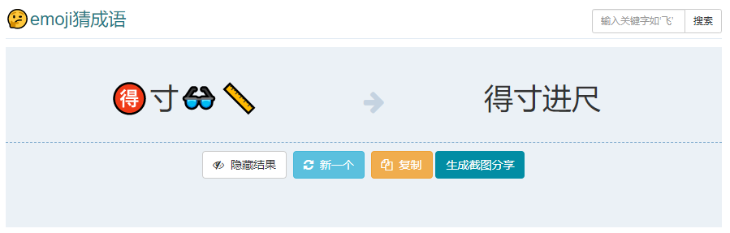

# Idiom | 成語

  

|  emoji  |  Idiom  ||  emoji  |  Idiom  | 
|:--:|:--:|--|:--:|:--:|
| 🤍🈚🍽️5️⃣ |心无旁骛 || 🤍🤍😣😣 | 辛辛苦苦|
| 🥵🔥🌿🌁  |热火朝天 || 🏠👩📔😍 | 嘉人本色|
| 🐠💋🉐💪 |渔翁得利 || 🐝🈴☀️🍐 | 风和日丽|
| ☀️🐔🌙😪 |日积月累 || 🥴➕1️⃣💡  | 罪加一等|
| 👂👀1️⃣🆕  |耳目一新 || 将🤍🅱🤍 | 将心比心|
| 🐔鸣🐶🌾  |鸡鸣狗盗 || 🌁🥕💧🕸️ | 天罗地网|
| 🥣🟣1️⃣0️⃣0️⃣0️⃣🔴|万紫千红|| 🐔🎻4️⃣🏹 | 激情四射|
| 🍢🗑️1️⃣💨 |串通一气 || 🦴⌛🥒🦟 | 孤陋寡闻|
| 🤳🐌🌬️🤫 |自我吹嘘 || 🥜4️⃣📦1️⃣| 生死相依|
| 🈹9️⃣🈹🦎 |各就各位 || 🉐寸👓📏 |得寸进尺 |
| 🉐🎂🔭🕰️ |德高望重|| | | 
