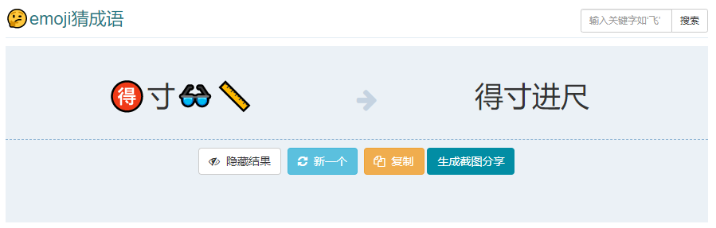

# Idiom | 成語

  

<section id="main">

<h1><a href="/Game/chengyu">🤔emoji猜成语 </a>
<form action="/Game/search" method='get'>
<input type="text" class="form-control input-sm" placeholder="输入关键字如‘飞’" name='keyword'><input type="hidden" name='category' value='chengyu'><input type="hidden" name='cid' value='4'><button class="btn btn-default btn-sm" type="submit">搜索</button>
</form>
</h1>

<table class="table"><tr><td class='text-center page-emoji' width='50%'>名🐪🎍🏔️</td><td class='text-center'  width='50%'>******名落孙山</td></tr></table><i class="fa fa-arrow-right"></i>

<a href="javascript:;" class="btn btn-default page-show-ans" data-ans="名落孙山"><i class="fa fa-eye"></i>显示结果</a>&nbsp;&nbsp;<a href="javascript:;" class="btn btn-info page-new-ex" data-cid='4'><i class="fa fa-refresh"></i>新一个</a>&nbsp;&nbsp;<a href="javascript:;" class="btn btn-warning ex-copy"  data-clipboard-text="【名🐪🎍🏔️】

↓↓↓

名落孙山" ><i class="fa fa-copy"></i>复制</a>&nbsp;<a href="javascript:;" class="btn btn-blue" id='convert'>生成截图分享</a>

来源: emojidaquan.com

<button type="button" class="close" data-dismiss="modal" aria-label="Close">&times;</button><h4 class="modal-title">截图(长按保存)</h4>

  
